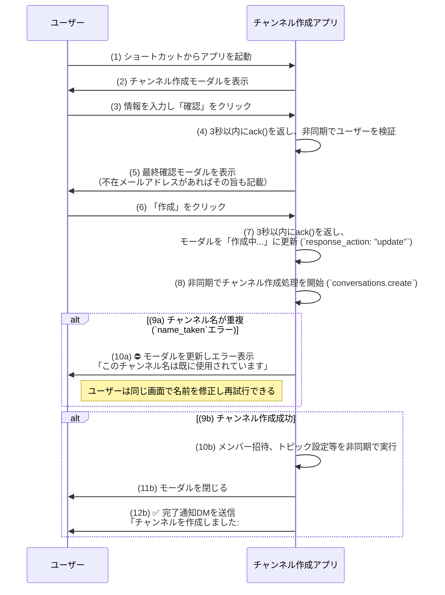

# Slackチャンネル作成アプリ 要件定義書

**バージョン: 3.0**

## 1. 概要

本ドキュメントは、Slack上で特定のメンバーを含む新しいプライベートチャンネルを簡易的に作成するためのアプリケーション（以下、本アプリ）の要件を定義する。本アプリは自ワークスペース内のメンバーのみを対象とし、Slack Connectによる外部組織メンバーの招待はスコープ外とする。

### 1.1. 開発の背景と目的

メールアドレスリストを元に手動でSlackチャンネルを作成・招待する作業を自動化し、モーダルUIを通じて迅速かつ正確なチャンネル作成を実現する。

### 1.2. アプリの主要機能

- モーダルUIでチャンネル名とメンバーのメールアドレスを一括入力させる。
    
- 入力されたメールアドレスからSlackユーザーを解決する。
    
- **入力内容の事前確認ステップ**を設け、誤入力を防止する。
    
- 指定されたチャンネル名でプライベートチャンネルを作成し、メンバーを招待する。
    
- チャンネル作成後、初期メッセージ、トピック、説明文を自動設定する。
    

## 2. 機能要件

### 2.1. 操作フロー

### 2.2. 主要な仕様

- **インタラクション応答:**
    
    - すべてのインタラクションは **3秒以内に`ack()`** を返す。時間のかかる処理は非同期化し、処理中の状態や最終結果はモーダルの更新（`views.update`）またはDMでユーザーにフィードバックする。
        
- **チャンネル名の仕様とバリデーション:**
    
    - Slackの命名規則（**英小文字・数字・ハイフン・アンダースコアのみ、最大80文字**）に準拠する。
        
    - 入力に対し、全角→半角、空白→ハイフンなどの**正規化**を自動で行う。
        
    - 重複チェックは`conversations.create` APIの応答（`name_taken`エラー）を正とする。重複時は **モーダルを更新して** エラーを通知し、ユーザーに修正を促す。
        
- **メンバーの指定と扱い:**
    
    - メールアドレスの入力に対し、大小文字の正規化、重複除去、余分な区切りの圧縮を行う。
        
    - 「不在」とみなすケース：Slackに登録がない、退会済み、無効化されたアカウント。
        
    - メールアドレスが見つからない場合、確認モーダルで不在メールアドレスの一覧を提示し、処理を続行するかユーザーに選択させる。
        
    - 入力された有効なユーザーが **全員不在** の場合、エラーとしてモーダルで通知し、処理を終了する。
        
    - **確認モーダルでは解決されたユーザーを表示名（display_name）で表示する。** UserIDではユーザーが判断できないため。
        
    - **チャンネル作成者は自動的にチャンネルメンバーに含める。** 管理不能のチャンネルを防ぐため、作成者は必ず参加者となる。重複指定された場合は重複を排除する。
        
- **招待処理:**
    
    - **本アプリ（Bot）は`conversations.create` APIでチャンネルを作成した際、自動的にそのチャンネルのメンバーとなる**ため、続けてメンバー招待が可能である。
        
    - `conversations.invite` APIを使用し、招待は **1回あたり1〜1,000件**の 単位でバッチ処理する。
        
    - 部分的な招待失敗時は、最大3回のリトライを試行し、最終的に失敗したユーザーは完了通知DMに記載する。
        
- **チャンネル作成後の自動設定:**
    
    - `chat.postMessage`: （将来）初期メッセージの投稿を検討する。現行実装では作成者への完了DMのみ送信する。
        
    - `conversations.setTopic` / `conversations.setPurpose`: （将来）トピックと説明の自動設定を検討する。現行実装では未実装。
        

### 2.3. エラーハンドリング詳細

|   |   |   |
|---|---|---|
|**エラーケース**|**APIエラー例**|**ユーザーへの通知方法と内容**|
|**チャンネル名重複**|`name_taken`| **モーダル更新** ：「このチャンネル名は既に使用されています。別の名前で再度お試しください。」|
|**権限不足**|`restricted_action`|DM通知：「アプリの権限が不足しています。管理者に連絡し、必要なスコープの追加を依頼してください。（不足スコープ候補: ...）」|
|**ユーザー不在**|`user_not_found`|確認モーダル：「以下のメールアドレスに該当するユーザーが見つかりませんでした。 [...] このまま続行しますか？」|
|**レート制限超過**|`rate_limited`|内部で`Retry-After`ヘッダーに基づきリトライ。処理が大幅に遅延する場合は中間報告DMを送信。完了通知は一括で行う。|
|**アーカイブ済み**|( `name_taken` に内包)|モーダル更新で重複している旨を伝える。アーカイブ解除と再利用の選択肢は提供しない。|

## 3. 非機能要件

### 3.1. 開発環境・言語

|   |   |   |
|---|---|---|
|**項目**|**内容**|**備考**|
|開発言語|Python 3.13|`slack-bolt`/`slack-sdk`の互換性を確認し、問題があれば3.11を代替とする。|
|実行環境|pipenv|-|
|フレームワーク|Slack Bolt for Python|-|
|実行モード|ソケットモード|プロトタイプ段階。本番投入時はHTTPモードへの移行を検討。|
|テスト|Pytest|重点テスト観点：競合状態での`name_taken`、大量招待時のレート制限、退会/無効化ユーザー混在時の解決処理。|
|コード品質|Ruff (Linter), Black (Formatter)|CI/CDパイプラインでの自動チェックを必須とする。|

### 3.2. パフォーマンスと耐障害性

- **応答性:** ユーザー操作への`ack()`は3秒以内に返す。
    
- **バッチ処理:** 招待処理は最大1,000件単位で行う。
    
- **レート制限:** APIからの429応答時、レスポンスヘッダーの **`Retry-After`値に従い** 、指数バックオフを伴うリトライを行う。Tier番号などの固定値には依存しない。
    
    - **冪等性/メタデータ:** `private_metadata` は Slack 制限（3000字）に抵触しないよう、長大化した場合は一時ストアのトークン参照に切り替える（TTLあり）。
    

### 3.3. セキュリティ (Slack APIスコープ)

アプリケーションが必要とするスコープは以下の最小構成とする。

|   |   |
|---|---|
|**スコープ**|**目的**|
|`users:read.email`|メールアドレスからユーザーIDを解決するため|
|`users:read`|ユーザー情報を取得するため|
|`groups:write`|プライベートチャンネルを作成するため|
|`conversations:write.invites`|メンバーをチャンネルに招待するため (推奨)|
|`conversations:write.topic`|チャンネルのトピック・説明を設定するため (推奨)|
|`chat:write`|チャンネルへのメッセージ投稿、DM送信のため|
|`im:write`|ユーザーとのDMチャンネルを開設するため|
|`connections:write`|(App-level Token) ソケットモード接続のため|

### 3.4. 運用と監視 (Observability)

- **ロギング:** 主要な処理フェーズ（ユーザー検索、チャンネル作成、招待など）の開始・成功・失敗を、相関IDと共にログ出力する。Slack APIのエラーコードも記録する。
    
